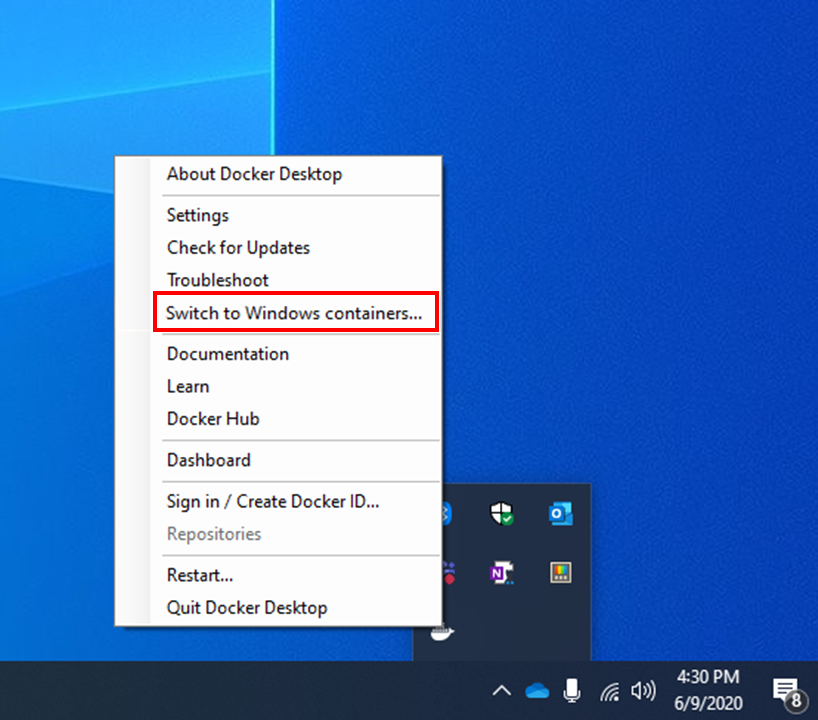

QuickStart - Using ADMB Docker Windows Image
============================================

*ADMB-13.2*  
*Released March 15, 2024*  

Details prerequisites and procedures to use the ADMB Docker Windows image for building and running ADMB models with the [simple example](https://github.com/admb-project/admb/tree/main/examples/admb/simple)

ADMB Docker Windows Image
-------------------------

The ADMB Docker Windows image uses the *Windows LTSC 2022 or 2019* as the base container.

Below is the list of tools that are preinstalled.

* Winlibs - GNU GCC version 13.2 
* ADMB - latest version

Prerequisites
-------------

The Windows operating system is needed on the host computer to use the ADMB Docker Windows Image.

* Download and install the [Docker Desktop](https://www.docker.com/products/docker-desktop/) for Windows.

After the installing Docker Desktop, double click the the Docker Desktop to run services, then set the Docker type to Windows Containers (read [documentation](https://learn.microsoft.com/en-us/virtualization/windowscontainers/quick-start/set-up-environment?tabs=dockerce#install-the-container-runtime)). The image below is a screenshot of where to go to switch to from Linux to Windows containers. 

Downloads
---------

Using the Docker Desktop, pull the [ADMB Docker Image](https://hub.docker.com/r/johnoel/admb/) or use the command below in the command prompt to download ADMB Docker Windows image.  The image uses *Windows 2022 LTSC* as the base container.

       docker pull johnoel/admb-13.2:windows

For Windows 10 users, use the docker image in the procedures below.  The image uses *Windows 2019 LTSC* as the base container.

       docker pull johnoel/admb-13.2:windows10

Usage
-----

1. Open Command Prompt and change to the model local directory. In this example we will be navigating to the simple directory under examples/admb/simple.

        cd C:\simple

2. Build simple.tpl into an Windows executable using the ADMB Docker Image and the mounted current local directory.

        docker run --env LDFLAGS=-static --rm --volume %CD%:C:\simple --workdir C:\simple johnoel/admb-13.2:windows simple.tpl

3. Run **simple.exe** Windows executable.

   There are two options, run the executable on the local Windows host or use the container to run program.

   Run local directory,
   
        simple.exe

   Or, use container to run executable.  The output files will be written to the directory on local directory.

       docker run --rm --volume %CD%:C:\simple --workdir C:\simple --entrypoint simple.exe johnoel/admb-13.2:windows

Console
-------

The procedure below shows how to use the interactive command line shell to build and run models.

1. Use docker to open container's interactive shell and mount current local directory to the container.

        docker run -it --entrypoint cmd --rm --volume %CD%:C:\simple --workdir C:\simple johnoel/admb-13.2:windows

2. Build and run simple model within the container's interactive shell.
    
      Build simple.tpl.

        admb simple.tpl

      Run simple executable.

        simple.exe

      Exit container shell.

        exit

Docker run options
------------------

Below details the options for **docker run**:

**Options**

* **-it** opens an interactive shell.

* **--env LDFLAGS=-static** builds a static executable (ie admb.cmd -p).

* **--entrypoint** resets the default program to run.

* **--rm** automatically removes temporary files from a docker run.

* **--volume** mounts the current local directory **%CD%** onto the container filesystem at **:C:\simple**.

* **--workdir** changes the container current directory to **C:\simple**. 

* **johnoel/admb-13.2:windows** is the name of the Docker Image and **simple.tpl** is the file to build.

Help
----

Below are links to documentation and online support for ADMB and Docker.

* [ADMB Manuals](https://www.admb-project.org/docs/manuals/)
* [ADMB Discussions(Support)](https://github.com/admb-project/admb/discussions)
* [Docker Documentation](https://docs.docker.com/)
* [Introduction to Containers and Docker](https://learn.microsoft.com/en-us/dotnet/architecture/microservices/container-docker-introduction/)
